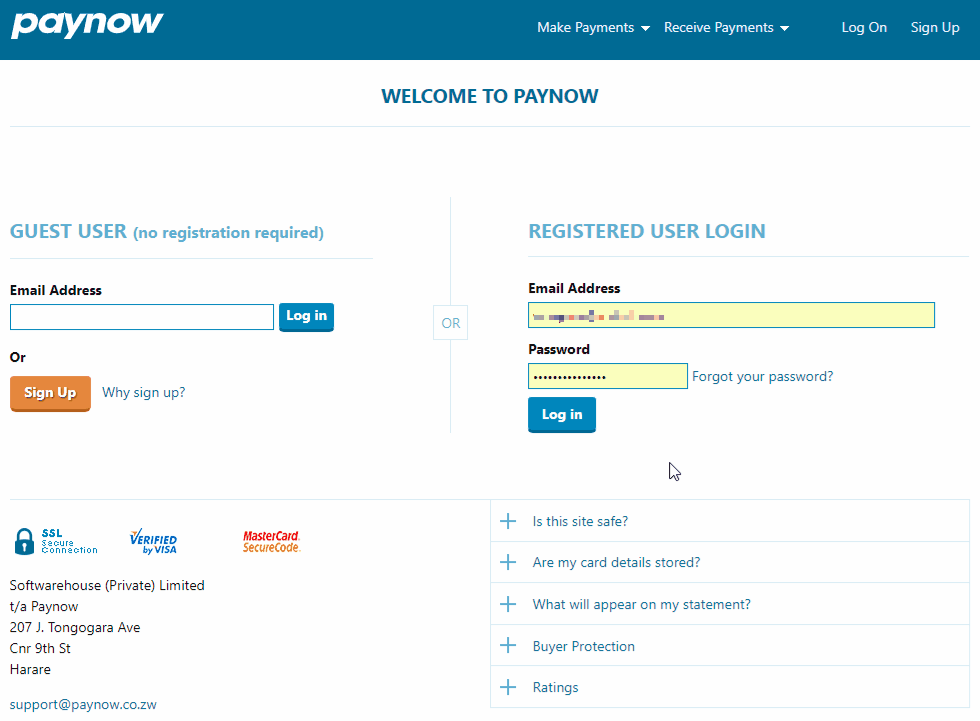

## Signup and Key Generation

Each integration needs its own ID and Integration Key to identify and secure all server to server
messaging. In order to get your Paynow ID and Key follow these steps:

1. Register on Paynow and follow the email validation steps.
https://www.paynow.co.zw/Customer/Register
2. Login with your newly created account and setup the bank account details you would like to
receive payment into.
3. Go to the [Other Ways To Get Paid] page.
https://www.paynow.co.zw/Home/Receive
4. Click [Create/Manage Shopping Carts]
5. Click [Create Advanced Integration]
6. Enter a name you will use to identify the integration.
7. Opt whether you with to absorb fees on this integration.
8. Enter the email address you wish to receive transaction updates to.
9. Notification URL should be left blank as we will be specifying individual URLs per transaction.
10. Enter any note you wish to keep about the integration, this will not be shown to the client.
11. Choose which Payment Methods you want this integration to use.
12. Click Save

<button id="gifReplay" class="button">Show me again!</button>

The integration will be created and you will be returned to the same page. In the Integration Keys
section you will see Integration ID, this is the id you will use below when initiating a transaction, note
this id is unique to the integration not your account, if you have more than one integration you will
get multiple ids.

For security reasons we do not display your integration key on this page, you need to click [Email Key
To Company Address]. It is vital you keep your Integration Key a secret.
You can now begin integration in test mode. It is recommended you [Generate New Key] when
moving your site from a development environment to live, this will stop you generating test
transactions on the live account and that any other developers will no longer know the Integration
Key.