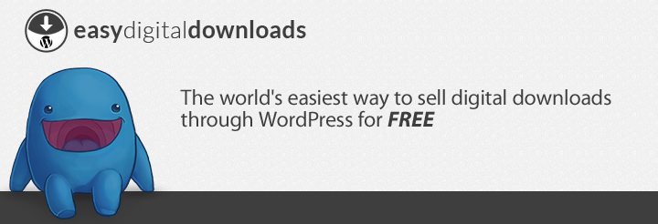
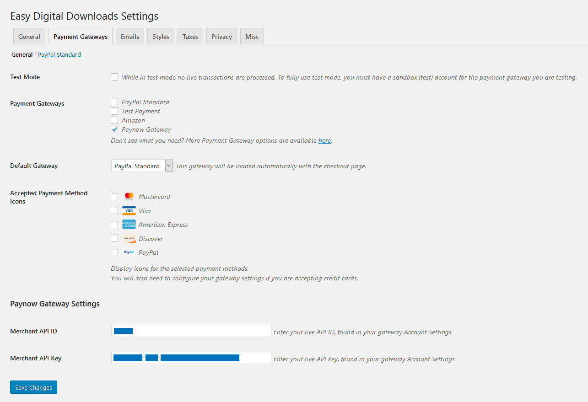

## Prerequisites

1. [WordPress](https://www.wordpress.org/)
2. [Easy Digital Downloads](https://wordpress.org/plugins/easy-digital-downloads/)
3. [Integration ID and Key](/docs/generation.md)

## Installation

1. Download and install the [Paynow for Easy Digital Downloads](https://github.com/paynow/Paynow-for-Easy-Digital-Downloads/archive/master.zip) plugin just like any other WordPress plugin. Go to **`Dashboard > Plugins > Add New > Upload Plugin`**
1. Navigate to the Plugins page and activate the plugin.

## Configuration

1. Once installed and activated, navigate to the Easy Digital Downloads Settings page via **`Downloads > Settings`** and then to the **`Payment Gateways`** tab.
1. Here you will find **Paynow Gateway** listed as one of the Payment Gateways. Click on its checkbox to enable it.
1. While on the same page, scroll down to the Paynow Gateway Settings section and enter your **Integration ID** and **Integration Key** into the **`Merchant api ID`** and **`Merchant API Key`** input fields respectively.
1. Click **Save Changes** and do a test checkout from the frontend of you site.

