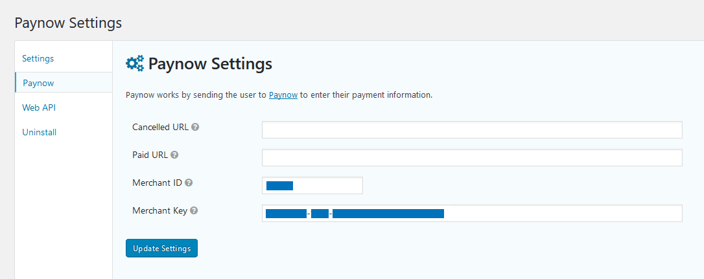
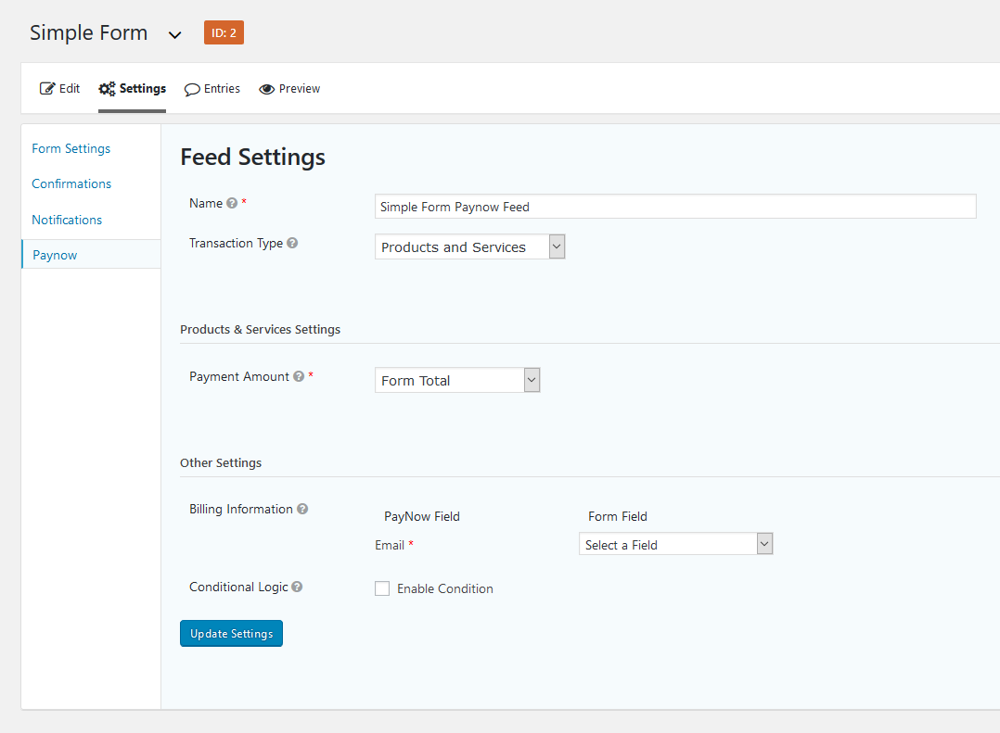

## Prerequisites

1. [WordPress](https://www.wordpress.org/)
2. [Gravity Forms](https://www.gravityforms.com/)
3. [Integration ID and Key](/docs/integration_generation.html)

## Installation

1. Download and install the [Paynow for Gravity Forms](https://github.com/paynow/Paynow-for-Gravity-Forms/archive/master.zip) plugin just like any other WordPress plugin. Go to **`Dashboard > Plugins > Add New > Upload Plugin`**
1. Navigate to the Plugins page and activate the plugin.

## Configuration

1. Once installed and activated, navigate to the Gravity Forms settings page via **`Forms > Settings`** and then to the **`Paynow`** tab.
1. On the Paynow settings page enter your **Integration ID** and **Integration Key** into the **`Merchant ID`** and **`Merchant Key`** input fields respectively.
1. Click **Update Settings** and create your form with the necessary [Pricing Fields](https://docs.gravityforms.com/category/user-guides/field-types/pricing-fields/) and Paynow Feed settings.

*Paynow for WooCommerce Settings*

*Paynow Feed settings*

