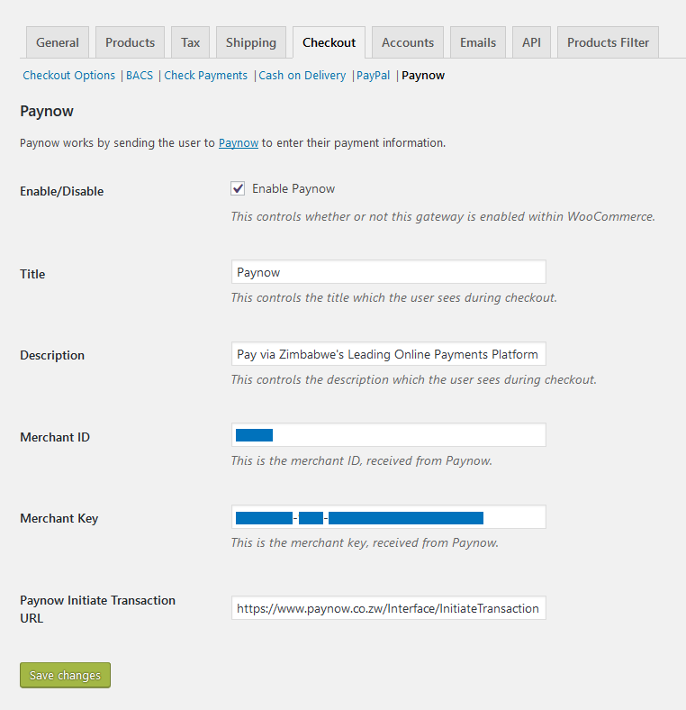

## Prerequisites

1. [WordPress](https://www.wordpress.org/)
2. [WooCommerce](https://wordpress.org/plugins/woocommerce/)
3. [Integration ID and Key](/docs/integration_generation.html)

## Installation

1. Download and install the [Paynow for WooCommerce](https://github.com/paynow/Paynow-for-WooCommerce/archive/master.zip) plugin just like any other WordPress plugin. Go to **`Dashboard > Plugins > Add New > Upload Plugin`**
1. Navigate to the Plugins page and activate the plugin.

## Configuration

1. Once installed and activated, navigate to the WooCommerce settings page via **`WooCommerce > Settings`** and then to the **`Checkout`** tab.
1. Here you will find **Paynow** listed as one of the Chekout Options. Click on it to open its settings page.
1. On the Paynow settings page click the checkbox to enable the gateway and enter your **Integration ID** and **Integration Key** into the **`Merchant ID`** and **`Merchant Key`** input fields respectively.
1. Click **Save Changes** and do a test checkout from the frontend of you site.

